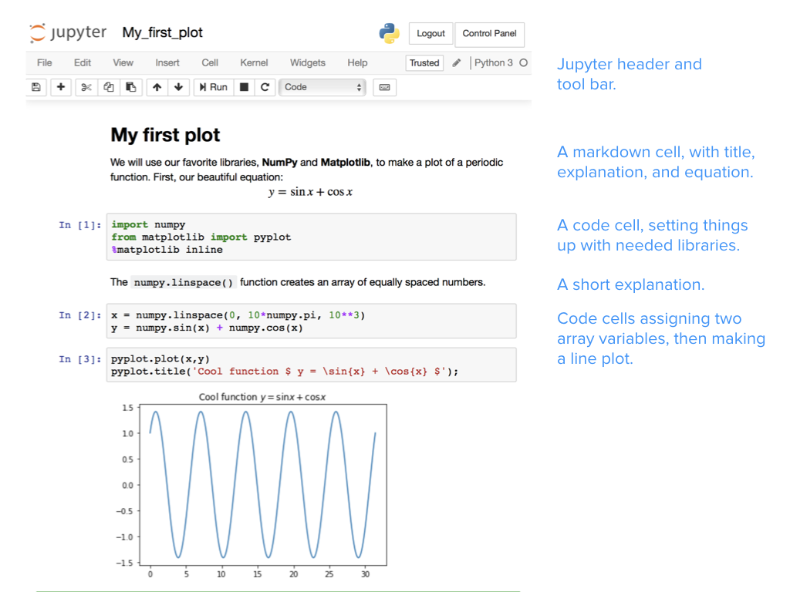
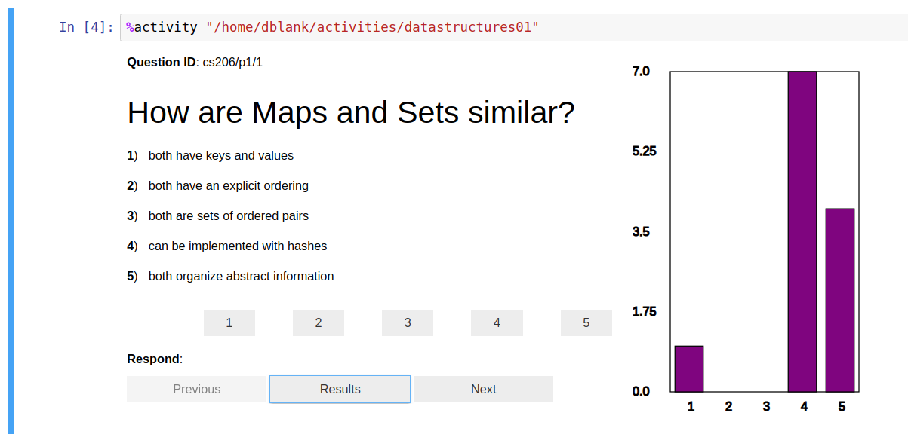

# Why we use Jupyter notebooks

## Why do we use Jupyter?

As teachers we are responsible for many activities, including creating lessons,
lectures, courses, assignments, and supportive environments; encouraging
engagement and performance in the classroom; helping students learn to think
critically so they can become lifelong learners and problem solvers; making
material relevant and meaningful to students' diverse interests and backgrounds;
assessing student learning (including grading and evaluation); encouraging
students to persist with emotional labor (feedback, communication, etc.); and
trying out teaching and learning practices that improve our ability to do all of
these things.

In short, we design learning environments and experiences.

We use Jupyter notebooks to design learning environments to help support these
activities. We believe that incorporating Jupyter notebooks in our teaching has
allowed us to improve students' understanding of course content, increase
student engagement with material and their participation in class, and to make
concepts more meaningful and relevant to students' diverse interests.  We
represent a variety of disciplines and have many diverse instructional goals,
all of which have been supported using Jupyter notebooks. The goal of this
handbook is to provide you with ideas to help you address your own instructional
and pedagogical goals.

Through a series of anecdotes we will illustrate how you, as an educator, can
use Jupyter notebooks to increase your students' 1) engagement, 2)
participation, 3) understanding, 4) performance, and 5) preparation for their
career.  These are starting places and we are confident that you will also take
these examples in new and exciting directions.

## But first, what is Jupyter Notebook?

Project Jupyter is three things: a collection of standards, a
community, and a set of software tools. Jupyter Notebook, one part of
Jupyter, is software that creates a Jupyter notebook.
A Jupyter notebook is a document that supports mixing executable code, equations,
visualizations, and narrative text. Specifically, Jupyter notebooks allow
the user to bring together data, code, and prose, to tell an
interactive, computational story. Whether analyzing a corpus of American
Literature, creating music and art, or illustrating the engineering concepts
behind Digital Signal Processing, the notebooks can combine explanations
traditionally found in textbooks with _the interactivity of an application_.

Jupyter is a free, open source platform that is an excellent learning
environment for students. For teachers, it increases our efficiency and
decreases cognitive load so we can engage students. Notebooks can be useful for
achieving your goals as a teacher in numerous environments from STEM labs or
humanities narratives, to podium lectures or flipped classrooms. We use Jupyter
notebooks in small classes and for classes that have hundreds of students.
Jupyter notebooks can be used for teaching part of one lecture or can be used to
teach a whole course.  Jupyter notebooks enable us and our students to have a
conversation with a problem and link to resources, like audio, video, images,
visualizations--and even allow students to mix and remix these. And yet students
need to install nothing beyond a modern web browser to use this free software.

Jupyter notebooks can be used to organize classroom materials and objects, store
and provide access to reading materials for students, present and share lecture
materials, perform live coding, explore and interact with materials, support
self-paced learning, grade students' homework, solve homework problems, or make
materials reusable to others (see Chapters 3 and 4).

Read on to find out how we have used Jupyter notebooks for teaching and learning
to benefit both our students and ourselves. Jupyter notebooks support a wide
range of learning goals, including learning to program, learning domain
knowledge, and practicing communication skills like storytelling. The authors of
this book have used Jupyter notebooks to teach:

*   Sciences
    *   Physics and astronomy
    *   Geoscience
    *   Biology
    *   Cognitive science
    *   Computer science
    *   Data science
    *   Statistics
    *   Social sciences
*   Writing
    *   Writing seminar
    *   Writing and technical communication
*   Digital Humanities
    *   Music
    *   Text analysis
    *   Metadata processing
*   Engineering
    *   Chemical engineering (kinetics and reactor design)
    *   Mechanical engineering
    *   Aerospace engineering
*   Introduction to Programming
    *   High school
    *   College and university-level courses (true introductions through advanced courses)

Our other use of notebooks for education include:

*   Building models/simulations (with and without programming)
*   Using widgets to demonstrate and interact with simulations
*   Visualizations of process and data

## Course benefits & anecdotes

### Engagement

As teachers we routinely struggle to engage our students, especially when we are
constrained by the format of the course (e.g., online, 50-minute lecture),
available technologies, students distractions, and/or other factors.
Nevertheless, it is substantially our responsibility to create environments and
experiences within these limits that engage students in our courses.  This is
where notebooks can give you another tool to break out of the mundane, and get
students engaged in their learning.

#### Conversations with data

The creators of Jupyter describe it as a set of open-source tools for
interactive and exploratory computing, and a platform for creating computational
narratives. Jupyter allows us, as educators, to narrate a "conversation between
the student and data". Consider this example, using the data of life expectancy
of many countries over the years:

> I use a short bit of code to make a graph showing the time evolution, in what
> is called a "spaghetti plot" (see figure). Looking at this messy graphic, I
> point out how most of the lines show growth over time: life expectancy is
> improving all over the world. But a couple of lines show a marked dip in a
> given year. I can ask students: which country had that dip? What happened
> there? Why? With a bit more coding, we identify that Cambodia had a shocking
> life expectancy of about 30 years in 1977, and Rwanda had even worse life
> expectancy in 1992. We then have the opportunity to discuss why these
> countries experienced a mortality crisis. The data brings to life a meaningful
> discussion, with many possible paths involving history, politics, economics,
> and health. -- Lorena Barba

](images/engcomp2lesson4-life-expectancy.png "Life expectancy in the years 1952-2007, across 142 countries")

Jupyter notebooks are essential tools of connection---tools that engage
learners in transitions in their thinking. The opportunity of intermingling
computation into a narrative, creating a conversation with data is a powerful
and effective form of communication. With Jupyter, you now have a new form of
content to create and share with learners: _computable content_. In a world
where every subject matter can have a data-supported treatment, where
computational devices are omnipresent and pervasive, the union of natural
language and computation creates compelling communication and learning
opportunities.

### Participation

Engaging students in your courses requires their participation and interaction
with you, their peers, and/or the content [@moore1989three]. How, when, and
why you use student participation in yours will, of course, depend on your
goals, the specific objectives for teaching the content within your course, your
students, and other factors.  Using notebooks, however, encourages participation
and gives you more tools for promoting participation. Notebooks can connect
students to authentic external audiences as well. Students can, for example,
consume notebooks from other classes, and publish notebooks where others can
read them.

#### Real world experience -- bringing concepts to life

Notebooks are living documents, meaning they can be edited to respond to
questions or input from students and used a conversation piece during a lecture
or presentation.

> Our group uses Jupyter notebooks as "apps" to demonstrate concepts in
> geophysics. These notebook-apps connect numerical simulations to widgets and
> relevant plots. In the classroom, we ask students to help define input
> parameters based on an application or case study that they are interested
> in. Prior to displaying the results, we ask students to build a mental image
> of their expectations. If the resultant image matches their expectations, then
> we have reinforced a concept, and if not, it is an opportunity to learn. We as
> instructors can interactively engage with students' questions by updating the
> inputs to the simulation in order to explore concepts with them. Students have
> access to the same notebooks through free web-platforms like Binder, so simply
> by following a link, they can take the steering wheel and engage with the
> concepts on their own. Notebooks bring the concepts to life and serve as a
> conversation piece for the interaction between learners and educators. --
> Lindsey Heagy

#### Real world experience -- Ticket to leave

Another example of generating participation in the classroom with Jupyter
notebooks is the Activity magic, available as an extension. It creates what has
been called a "ticket to leave" (or "exit ticket") via the notebook. The idea of
a "ticket to leave" is an excellent way to end a class or lab. Briefly, it is
just a survey that you give the students (see figure). Often, these surveys are
given via a Personal Response System (also known as "clickers" or PRS) or cell
phones. There are a few uses of such surveys:

1.  Give the instructor some feedback on the students' understanding, as a whole
1.  Provide time and opportunity for students to review and synthesize today's
    materials
1.  Allow the students to apply their recent knowledge to a novel problem
1.  An additional instance to learn the materials

These questions do not typically require much time to answer, but are meant to
capture the essence of the conversation of the class.  After a minute or so to
contemplate the question, the students select their answer (by clicking one of
the buttons), and instructor shows the gestalt results (see figure).

Good "exit ticket" questions can be domain specific questions, but can also be
metacognitive questions (about one's learning style, for example), or high-level
organizational questions (e.g., "what was the goal of today's discussion?"). We
recommend leaving enough time at the end of class (perhaps 10 minutes) to have a
full and complete wrap-up discussion. After the discussion, you may wish to
adjust the following class meeting if you feel that not enough students had the
insight you were aiming for. For more information on "tickets to leave" see
[https://www.brown.edu/sheridan/teaching-learning-resources/teaching-resources/course-design/classroom-assessment/entrance-and-exit/sample](https://www.brown.edu/sheridan/teaching-learning-resources/teaching-resources/course-design/classroom-assessment/entrance-and-exit/sample).
For more on the Jupyter Notebook extension, see
[using](https://github.com/Calysto/metakernel/blob/master/metakernel/magics/README.md#activity)
and [installing](https://github.com/Calysto/metakernel#use-metakernel-magics-in-ipython)
Calysto Activity magic.

### Increasing understanding

Within any course you will typically try to achieve a diverse set of objectives.
Benjamin Bloom (https://en.wikipedia.org/wiki/Bloom%27s_taxonomy) provided a
framework for the detailed objectives we want to achieve, ranging from basic
knowledge (such as, terminology, specific facts, trends and sequences,
classifications and categories, etc.) all the way to ability to evaluate and
create (such as, abstract relationships, judgments but based criteria, original
works).  Achieving the former (i.e., basic knowledge and comprehension) is far
easier to achieve than understanding (i.e., evaluation and creation); yet, most
often we, as educators, are striving for increasing the complex understanding of
our students on the topics we are teaching.  The good news is that notebooks
offer a valuable tool for teaching toward understanding -- moving students, for
example, from passively viewing course content to exploring, analyzing,
synthesizing, and evaluating the content in active ways.

#### Real world experience -- Guiding learners at their own pace

The fundamental theory behind Computational Fluid Dynamics (CFD) used in
Aerospace Engineering is based on understanding the Navier-Stokes equations.
"CFD Python" is a collection of Jupyter notebooks based on a practical module
that Lorena Barba began using in class in her Computational Fluid Dynamics (CFD) course at
Boston University in 2009. The 5-week module develops worked examples that build
on each other to incrementally guide the learner to create a program to solve
the Navier–Stokes equations of fluid dynamics, in 12 steps.

> In 2013, I was invited to teach a 2 day mini-course in the Latin-American
> School in High-Performance Computing, in Argentina. The Jupyter notebooks
> platform allowed me to create a guided narrative to support learners with
> different background experience and knowledge. For that event, we wrote
> notebooks based on the CFD course module, to use as instructional scaffolding
> in the minicourse. Twenty students worked through the notebooks as self-paced
> lessons, while I went from desk to desk asking and answering questions. About
> four of the students completed all 12 steps in the 2 days, a bulk of them
> achieved up to about Step 8, and a few of them lagged behind in Steps 4 or 5
> by the end of the course. For those who completed the full module, they had
> achieved in 2 days what my regular students in the classroom normally took 5
> weeks to do. Seeing that was an eye-opening moment: both the power of worked
> examples in code, and the ability to allow learners to follow their own pace
> made a remarkable difference in these learners. -- Lorena Barba

Based on the experience developing the "CFD Python" learning module [@barbacfd],
this basic design pattern was adopted for creating lessons using computable
content:

1.  Break it down into small steps
1.  Chunk small steps into bigger steps
1.  Add narrative and connect
1.  Link out to documentation
1.  Interleave easy exercises
1.  Spice with challenge questions/tasks
1.  Publish openly online

This was particularly helpful for student understanding.

### Increasing student's performance

The goal of learning is often actualized through the performance of students.
This is routinely most visible by what we attempt to assess during and at the
end of instruction. Using notebooks we can create a variety of a performance
opportunities for students, thereby giving them more opportunities for practice
and feedback, as well as more opportunities for us, as instructors, to
assess their ability to perform.

#### Real world experience -- The worked-example effect

The worked-example effect is the best known and most widely studied of the
cognitive load effects [@sweller2006worked]. It refers to providing full
guidance on how to solve a problem, resulting in better student performance than
problem-solving conditions with no guidance. For complex tasks, inexperienced or
beginner learners benefit the most from the worked-examples procedure. One study
[@chen2015worked] concludes that: "worked example effect occurs for complex,
high-element interactivity materials that impose a heavy working memory load"
and "when dealing with complex material that learners may have difficulty
understanding, high levels of guidance are likely to result in enhanced
performance over lower levels of guidance." This research-based guidance seems
especially relevant for teaching novice programmers to use computation in the
context of their subject matter (science, engineering, or other).

### Increasing students' preparation for their career

In preparing students to apply what they have learned, striving to align what
happens in the course with what they will experience in their career is
important. From using parallel software to mirroring workflows,  we want our
students to experience and be prepared for the workplace. Recognizing, of
course, that workplaces are not static and the skills required for a career are
always emerging, using notebooks provides a flexible platform to build skills
and build portfolios of what students can do.

#### Real world experience --  Publishing a data narrative as a demonstration of industry ability

For Data Science careers, a publicly shared narrative about a data analytics
project goes a long way at demonstrating the student's potential at an
interview. Elizabeth Wicks has her students develop a Jupyter notebook that
tells the story of a data munging and analysis project done in the class. The
students then publish this notebook to their Github profile pages. Being that
Jupyter is one of the most popular ways in industry to communicate data science
results, the students have a very valuable key to a potential career.

TODO: Add quote from Elizabeth

## Student benefits

Creating opportunities for students to develop as learners stretch beyond the
boundaries of any specific course where you may use notebooks.  By enriching
their learning experience in your course, you will help them develop valuable
skill-sets and mind-sets that they will take with them into other courses and
into their career.

### Computational thinking

Jupyter notebooks support a wide range of learning goals. Its interactivity
enables building intuitive understanding of domain knowledge, such as the
understanding of a mechanical response of a system while varying parameters or
understanding how an algorithm behaves. Notebooks can also help teach effective
communication skills, combining prose with graphics into a strong narrative.
Finally, notebooks can support teaching or strengthening programming skills, by
combining code with text descriptions and visualizations. Even if a notebook is
designed to be consumed passively, the exposure to code helps show students how
to do something—and that they can do it themselves. This also helps demystify
coding for students who do not view themselves as traditional "computer science"
types.

Using notebooks, you can create rich learning experiences that link together the
core foundations of computational thinking:

*   _Decomposition_: Breaking down data, processes, or problems into smaller, manageable parts
*   _Pattern Recognition_: Observing patterns, trends, and regularities in data
*   _Abstraction_: Identifying the general principles that generate these patterns
*   _Algorithm Design_: Developing the step by step instructions for solving
    this and similar problems

### Open-source

Integrating notebooks into classes also exposes students to a large and growing
ecosystem of open-source tools. This supports their education, but also provides
experience in the same environment of tools used in industries in high demand
for trained employees, such as data science and machine learning. The
open-source nature of these tools also ensures that course content remains
accessible and affordable to all students—including those outside the
traditional university environment.

Unlike proprietary notebook technologies such as Mathematica, or specific
programming languages/environments such as Matlab or C++, the barriers to entry
for students learning with Jupyter notebooks can be extremely low. At a minimum,
during a lecture, students can simply watch/read an interactive demo using a
notebook, to replace slides or lecture notes. On their own, using a cloud
service such as Binder or JupyterHub, students can open any modern web browser
to some address and interact with a notebook (an example of this technology can
be found at <https://jupyter.org/try>), without
needing any installation or configuration. In the most complicated case,
students can install Anaconda and follow simple instructions to install the
Jupyter Notebook, which works and looks the same on all platforms—and is free
and open source.

### Active learning

Thanks to their interactivity, notebooks enable a spectrum of active learning
methods, which have been shown to increase performance in science, engineering,
and mathematics [@freeman2014active]. To start, students can consume notebook
content by reading and running notebooks, then move to editing or completing
notebooks as assignments. This allows students to focus on the content and
concepts, rather than just note-taking.

At the top of Bloom's Taxonomy is pure creation, where students can, for
example, author complete computational essays. In both cases, notebooks support
courses where students have a wide range of experience and ability: students who
need help can rely on the scaffolding of prose explanations and existing code,
while also providing room to stretch and explore for more-experienced students.
The additional annotation and prose that accompanies code also helps support
non-traditional learners and students from underrepresented groups who may have
less initial experience/comfort with programming.

Instilling the habits of active learning, through the use of notebooks, will
also provide benefits beyond the boundaries of your course. Interactivity drives
engagement, interest, and exploration of concepts. Engaged students in your
course are more likely to be engaged learners in other courses and beyond.

## Instructor benefits

Notebooks can be adopted at a variety of levels and formats, offering
flexibility based on the needs of a course and comfort/interest level of the
instructor: in-class demos, interactive labs, auxiliary material (e.g., book
replacements, lecture note supplements), assignments, or full course content in
a flipped learning environment. Notebooks offer a route to active learning
methods for instructors without experience of them, but do not force a
particular teaching style.

At a minimum, notebooks can be used to make publishable and interactive lecture
notes that blend narrative text, images, videos with image and results to
present the concepts. Furthermore, these course materials can be developed
gradually, starting with a low-effort draft to a more-polished, publishable
document that can be easily extended over time—and adopted by others. The growth
of open-source communities around software tools and educational resources
creates more opportunities for the re-use and adaptation of existing resources.

While many notebook authors do use Python, the Jupyter Notebook supports many
languages, so students (and instructors) are not tied to one specific language.
Indeed, the name Jupyter comes from three languages: Julia, Python, and R.
Furthermore, these (free) tools have minimal barriers to entry—using a cloud
infrastructure means students and instructors do not have to install anything,
while in the "worst" case installations require a few command-line excursions,
but these are free, openly available, and cross-platform.

## Conclusions

We hope that this chapter has illustrated that teaching with Jupyter notebooks
can be valuable for you and your student. We have shown notebooks to be a tool that
can increase student engagement, participation, understanding, performance, and
preparation for their careers.  These are substantial accomplishments that can be
achieved in a variety of disciplines and content areas. Using several real world
examples, we attempted to illustrate the numerous ways teachers are using
notebooks. Hopefully these, when combined with the chapters that follow, will
guide you in 1) supporting your students' learning, 2) giving you confidence
that you can use notebooks, 3) help you understand the necessary logistics, and
4) help give you clear expectations of what can be accomplished with Jupyter
notebooks.
